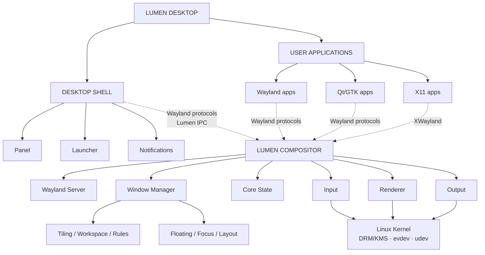
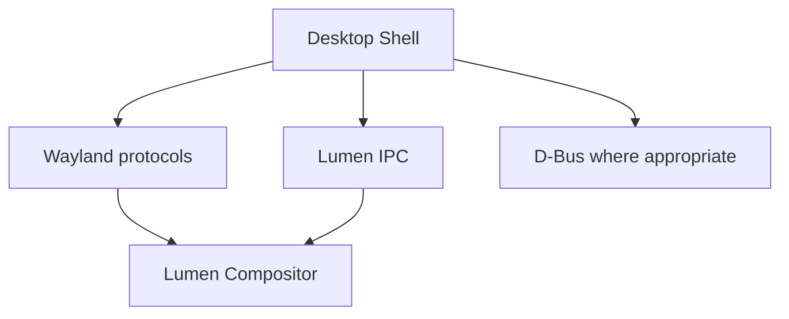
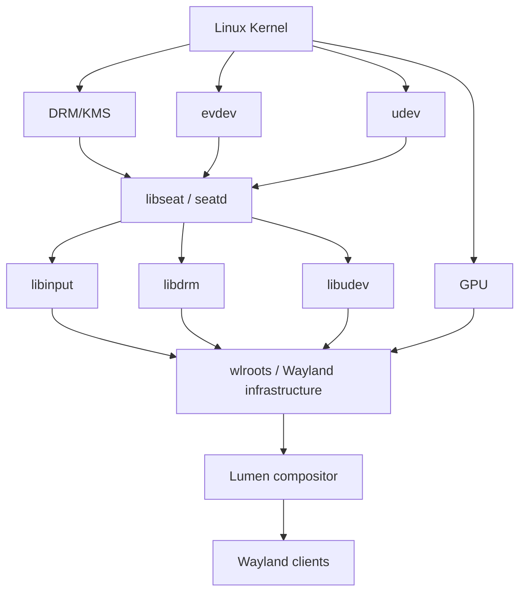

# Lumen Architecture

**Status:** Phase 0 architecture proposal (review required)  
**Project:** [Nexora-hat/Lumen](https://github.com/Nexora-hat/Lumen)  
**Copyright:** Copyright (c) 2026 Ramajayam A, Abinesh V, Abishek A S, and Yogananth S  
**License:** MIT

This is the canonical architecture document for Lumen. It describes the
boundaries and intended direction of the project without implying that
proposed or future components already exist.

## Status vocabulary

* **CONFIRMED** — established by the repository or an agreed project decision.
* **CURRENT** — part of the present project state.
* **PROPOSED** — intended design, subject to implementation and review.
* **FUTURE** — explicitly deferred capability or integration.
* **UNDECIDED** — no final decision has been made.

## Project identity and vision

Lumen is a Fedora-based Linux desktop/compositor ecosystem centered on a
Wayland compositor with an integrated window manager. Lumen is not merely a
window manager. The compositor and window manager may run in one executable,
but remain separate modules with separate responsibilities.

The vision combines modern Wayland compositor capabilities, tiling and
floating windows, workspaces, deep customization, and a polished desktop
experience. The longer-term ecosystem may include a desktop shell, settings
application, launcher, panel, notifications, plugins and a plugin listing or
store, website, X11 compatibility, game mode, file-manager actions such as
WhatsApp/LocalSend integrations, and GRUB/Plymouth and other Linux system
integrations.

These are not claims that all capabilities exist today. Windows application
support is an aspiration through Wine/Proton integration, not a guarantee
that every Windows application will work.

### Founding collaborators

* Ramajayam A
* Abinesh V
* Abishek A S
* Yogananth S

## Repository baseline

At the time this document was created, the repository contains:

```text
AUTHORS
LICENSE
README.md
```

There is no source implementation, build system, test suite, shell, plugin
tree, or previous architecture document in the repository. The structure
below is therefore a proposed implementation structure, not a description of
files that already exist.

## High-level architecture



The compositor owns the server-facing lifecycle and coordinates input,
rendering, outputs, and core state. The window manager owns policy about
windows, focus, layouts, and workspaces. The shell is a client of the
compositor, never a private in-process extension of it.

## Module boundaries and responsibilities

### Wayland compositor

The compositor module is responsible for:

* creating and running the Wayland server and its event loop;
* accepting and destroying Wayland clients and surfaces;
* managing surface roles, buffers, commits, damage, and synchronization;
* coordinating protocol handling, compositor state, input, rendering, and
  outputs;
* integrating wlroots backends and translating their events into core
  events; and
* enforcing compositor-wide lifecycle and policy boundaries.

It must not embed shell GUI code or make a GUI toolkit a compositor-core
dependency.

### Window manager

The window-manager module consumes defined core abstractions and manages:

* the window model, focus, stacking, and activation policy;
* tiling, floating, movement, resizing, and fullscreen behavior;
* workspace assignment and switching;
* window rules and layout algorithms; and
* relationships among windows, workspaces, and outputs.

It decides where and how a window is arranged; it does not implement the
Wayland server, DRM/KMS, input backends, or GPU renderer.

### Rendering subsystem

The renderer converts compositor and window-manager state into frames. It
handles scene composition, damage tracking, frame scheduling, GPU resource
lifetime, multi-output rendering, and a software fallback where supported.
Visual effects are future policy layered on this subsystem, not a reason to
couple the shell to the renderer.

### Input subsystem

The input subsystem discovers devices, receives events, maps them to outputs
and seats, applies keyboard state, and dispatches either Wayland input events
or compositor actions. It owns input policy but delegates device and
keyboard infrastructure to libinput and xkbcommon.

### Output/display subsystem

The output subsystem owns output discovery and lifecycle, display modes,
refresh rates, transforms, enablement, output configuration, and the
relationship between outputs and visible workspaces. DRM/KMS access is
provided by the lower-level stack.

### Workspace/layout subsystem

This subsystem models workspaces and layout state independently from protocol
transport. It provides layout algorithms and placement decisions to the
window manager while leaving exact workspace behavior open for review.

### Configuration subsystem

Configuration will eventually cover keybindings, workspaces, layouts, window
rules, appearance, monitor/output settings, compositor settings, and plugins.
The likely user directory is `~/.config/lumen/`, with possible files
`lumen.conf`, `keybindings.conf`, `workspaces.conf`, `rules.conf`,
`appearance.conf`, and a `plugins/` directory. The syntax, reload semantics,
validation behavior, and file format are **UNDECIDED/FUTURE**.

### IPC subsystem

IPC is the explicit boundary between the compositor, shell, settings,
external tools, and plugins. It should eventually provide commands, queries,
events, state information, structured errors, and authorization/security.
The transport and final protocol are **UNDECIDED**; no wire format is
specified by this document.

### Plugin subsystem

Plugins are a **FUTURE** major component. The subsystem must define discovery,
lifecycle, API and ABI/version compatibility, capabilities, permissions,
failure isolation, stability expectations, and revocation or removal.
Plugins must never rely on compositor private memory.

### Desktop shell

The shell is a separate set of Wayland clients and services. Possible
components are a panel, launcher, settings application, notifications,
wallpaper service, and desktop services. It communicates through Wayland
protocols, Lumen IPC, and D-Bus where appropriate:



The compositor must not directly depend on the shell's GUI toolkit.

### Compatibility subsystem

Compatibility layers remain modular:

* **X11 (CURRENT/PROPOSED):** use XWayland. The boundary is
  `X11 application -> XWayland -> Lumen`.
* **Windows applications (FUTURE):** integrate
  `Windows application -> Wine -> Wayland/X11 integration -> Lumen`.
* **Games (FUTURE):** integrate
  `Game -> Steam/Proton -> Wine -> Wayland -> Lumen`.

Lumen does not implement Wine or Proton and does not promise universal
Windows compatibility.

### System integration

Future integrations may use D-Bus for networking, Bluetooth, and system
services; xdg-desktop-portal for screen sharing, file choosers, and
permissions; and PipeWire for audio, video, screen capture, and recording.
These are not mandatory compositor-core dependencies without an explicit
justification.

## Low-level stack



Lumen should reuse wlroots and established Linux/Wayland libraries rather
than reimplementing DRM/KMS, input backends, device discovery, rendering
backends, and protocol infrastructure. Reuse reduces security and hardware
compatibility risk, avoids duplicating mature event-driven code, and keeps
project effort focused on Lumen policy. Individual Lumen modules need not
directly link every wlroots dependency; dependency ownership belongs at the
appropriate integration boundary.

### Proposed technology stack

| Technology | Purpose | Status | Reason | Unresolved questions |
|---|---|---|---|---|
| C11 or C17 | Core implementation language | **CONFIRMED: C; version UNDECIDED** | Fits the low-level compositor domain and existing project decision | Select C11 or C17; compiler and warning baseline |
| libwayland-server | Wayland server primitives | **PROPOSED** | Standard server infrastructure | API baseline and ownership conventions |
| wayland-protocols | Protocol definitions | **PROPOSED** | Interoperable protocol contracts | Required protocol subset and version policy |
| wlroots | Compositor backends and abstractions | **PROPOSED** | Reuses mature Wayland, backend, output, input, rendering, and XWayland infrastructure | Exact version/API strategy and compatibility policy |
| libinput | Input device events | **PROPOSED** | Mature Linux input abstraction | Seat configuration and supported devices |
| xkbcommon | Keyboard layouts and state | **PROPOSED** | Standard keyboard interpretation | Layout configuration and compose behavior |
| libdrm | DRM device interaction | **PROPOSED** | Standard userspace DRM interface, normally behind wlroots | Direct versus indirect usage |
| GBM | Buffer allocation | **PROPOSED** | GPU buffer allocation integration | Backend-specific allocation policy |
| EGL | Rendering context and surfaces | **PROPOSED** | Standard context management for OpenGL ES | Context ownership and fallback behavior |
| OpenGL ES | GPU rendering | **PROPOSED** | Broad Linux GPU support | Minimum feature level and effects strategy |
| libseat / seatd | Session and device access | **PROPOSED** | Safe seat acquisition without duplicating session management | Deployment and distribution defaults |
| libudev | Device discovery | **PROPOSED** | Linux device enumeration and monitoring | Which discovery remains in wlroots |
| pixman | Software/fallback rendering | **PROPOSED** | Useful fallback and 2D primitives | Performance expectations and feature parity |
| XWayland | X11 compatibility | **PROPOSED** | Established X11-on-Wayland boundary | Optional packaging and lifecycle |
| D-Bus | Desktop/system services | **FUTURE** | Standard integration mechanism | APIs and whether a service belongs in shell or core |
| PipeWire | Audio/video/capture | **FUTURE** | Portal and desktop media integration | Scope and session ownership |
| xdg-desktop-portal | User-mediated desktop permissions | **FUTURE** | Standard permission and chooser boundary | Backend selection and shell integration |

Exact versions, compiler flags, package names, and whether every item is
linked by a given module are not established by the current repository.

## Rendering architecture

```text
Wayland Client
      |
Surface / Buffer
      |
Lumen Scene / State
      |
Renderer
      |
EGL / OpenGL ES
      |
GPU
      |
Output
```

The renderer should prefer GPU acceleration, schedule frames against output
refresh, track damage to avoid unnecessary work, and avoid unnecessary buffer
copies. It must compose multiple outputs correctly, isolate output-specific
state, and provide a pixman/software fallback where practical. Performance
work includes frame-time instrumentation, latency measurement, profiling,
and benchmarks. Future visual effects must be bounded by explicit budgets
and must not compromise basic compositor responsiveness.

## Input architecture

```text
Linux input device
       |
    libinput
       |
Lumen Input Manager
       |
 +------+------+------+
 |             |      |
Keyboard    Pointer  Touchpad
       |
   xkbcommon
       |
Focus/Event Dispatch
       |
 +------+----------------+
 |                       |
Wayland Client     Compositor Action
```

Input routing must account for seat, focus, grabs, keyboard state, pointer
constraints, and output mapping. Exact gesture, shortcut precedence, and
device configuration behavior remain **UNDECIDED**.

## Output management

The output module coordinates wlroots with DRM/KMS to discover and manage
monitors, supported modes, refresh rates, transforms, enablement, and
hotplug. It must support multiple outputs and expose stable output identity
to the workspace and configuration layers. The output/workspace policy
(for example, whether workspaces are globally numbered or output-local) is
**UNDECIDED**.

## Workspace and window model

The core model contains these entities:

* **Window:** a managed client surface, its state, rules, geometry, and
  relationship to a workspace.
* **Workspace:** a named or numbered collection of windows plus layout and
  focus state.
* **Output/Monitor:** a physical or logical display with mode, geometry, and
  visible workspace.
* **Layout:** a placement algorithm and its parameters for a workspace.
* **Focus state:** the active window, keyboard focus, and relevant stacking or
  activation state.

```text
Output 1
|
+-- Workspace 1
|   +-- Window A
|   +-- Window B
|
+-- Workspace 2
    +-- Window C
```

An output displays a workspace; a workspace owns layout state and references
windows; a layout computes window geometry; focus identifies the active
window and drives input dispatch. The exact rules for moving windows between
outputs, persistent workspaces, stacking, and focus fallback are not final.

## Configuration and IPC principles

Configuration parsing, validation, defaults, and runtime reload must pass
through defined configuration interfaces rather than private module state.
External tools, shell components, and settings must use IPC rather than
accessing compositor memory.

The eventual IPC design must specify transport, message schemas, commands,
queries, subscriptions/events, version negotiation, error semantics,
authentication, authorization, and lifetime behavior. This document
intentionally does not choose a final protocol.

## Plugin model options

The following alternatives require an explicit decision:

| Model | Benefits | Risks/questions |
|---|---|---|
| In-process dynamic libraries | Low latency and direct API access | Crashes or memory corruption can take down the compositor; ABI and permissions are difficult |
| Out-of-process plugins | Failure isolation and clearer permissions | IPC overhead, lifecycle complexity, and limited access to low-latency state |
| Hybrid model | Can reserve trusted low-level hooks while isolating most extensions | Highest design and testing complexity; trust tiers and APIs must be explicit |

No model is selected. Any final design must address discovery, signing or
trust, capabilities, sandboxing, version compatibility, resource limits,
shutdown, crash recovery, and malicious plugin behavior.

## Dependency rules

1. The desktop shell must not access compositor private memory directly.
2. The window manager must use defined core abstractions.
3. Plugins must use the public plugin API.
4. External tools must use IPC.
5. Configuration must use defined configuration interfaces.
6. Compatibility layers remain modular.
7. GUI toolkits must not become unnecessary compositor-core dependencies.
8. Low-level Linux infrastructure should be delegated to appropriate
   libraries.
9. Core interfaces should minimize unnecessary coupling.

## Initial security model

The initial security concerns are:

* isolation between Wayland clients;
* authentication and authorization for IPC;
* plugin permissions, malicious plugins, and failure isolation;
* plugin and shell filesystem access;
* external command execution and argument handling;
* privileged operations;
* portal-based permissions for sensitive desktop capabilities.

This is an initial security model, not a complete security specification.
Threat modelling, trust boundaries, sandboxing, audit logging, and secure
upgrade/revocation policy require dedicated design work.

## Performance principles

Performance work should measure and protect frame scheduling, damage
tracking, GPU acceleration, input latency, event-loop efficiency,
multi-monitor frame time, memory management, and unnecessary buffer copies.
Profiling and reproducible benchmarks should cover startup, idle, interaction,
workspace changes, output hotplug, and rendering-heavy scenes. Correctness
and responsiveness take priority over speculative effects.

## Testing strategy

The planned test layers are:

* unit tests for core state, configuration, input translation, workspaces,
  rules, and layouts;
* integration tests for compositor startup, Wayland client lifecycle,
  protocol handling, input, rendering, and output management;
* workspace, tiling, floating, focus, fullscreen, and multi-monitor tests;
* regression tests for every fixed behavior;
* performance tests for frame scheduling, latency, memory, and rendering.

The testing framework, headless backend strategy, hardware matrix, and CI
policy are **UNDECIDED**.

## Proposed source tree

```text
src/
├── main.c
├── core/             # Lifecycle, event loop, shared state, public abstractions
├── wayland/          # Wayland server, protocols, clients, surface lifecycle
├── wm/               # Window policy, focus, tiling, floating, rules
├── workspace/        # Workspace entities and layout algorithms
├── renderer/         # Scene composition, damage, frame scheduling
├── input/            # Seats, devices, keyboard, pointer, dispatch
├── output/           # Outputs, modes, refresh, hotplug, configuration
├── config/            # Parsing, validation, defaults, runtime configuration
├── ipc/               # IPC transport, schemas, commands, events, auth
├── plugin/            # Future discovery, API, lifecycle, capabilities
└── compatibility/     # XWayland and future compatibility integrations

docs/
├── architecture/
├── decisions/
└── development/

tests/
shell/
plugins/
```

This is a proposal. It must be adapted to the build system and implementation
boundaries once source code exists; it does not replace the current
documentation-only repository structure.

## Development roadmap

1. **Phase 0 — Project Setup & Architecture:** establish repository,
   collaboration, roadmap, technology direction, and architecture review.
2. **Phase 1 — Linux / Wayland Foundation:** establish the C build and
   wlroots/libwayland integration.
3. **Phase 2 — Basic Compositor:** start the server, handle clients, and
   produce a minimal output/input loop.
4. **Phase 3 — Window Management:** add window model, focus, movement,
   resizing, floating, fullscreen, and rules.
5. **Phase 4 — Workspaces & Tiling:** add workspace state and layout
   algorithms.
6. **Phase 5 — Rendering Improvements:** improve damage, scheduling,
   multi-output rendering, fallback, profiling, and effects boundaries.
7. **Phase 6 — Desktop Shell:** develop panel, launcher, notifications,
   settings, wallpaper, and desktop services as clients.
8. **Phase 7 — Configuration + IPC + Plugins:** define and implement these
   public boundaries, including the plugin decision.
9. **Phase 8 — Compatibility:** integrate XWayland and evaluate future
   Wine/Proton and system integrations.
10. **Phase 9 — Testing & Stability:** expand regression, hardware,
    multi-monitor, performance, and reliability coverage.
11. **Phase 10 — Open-Source Release:** finalize packaging, documentation,
    contribution processes, release policy, and support expectations.

## Current status

Phase 0 is nearly complete. The project reports the following as completed
or almost completed: GitHub organization, Lumen repository, team access,
GitHub Project, board, Start Date field, Target Date field, C as the core
language, and the initial technology direction.

The current final Phase 0 task is to define the Lumen compositor
architecture. Phase 0 must not be marked complete until all four founders
review and agree on this document. This document does not change any GitHub
Project status.

## Open architecture decisions

The following remain unresolved and should be recorded as ADRs when decided:

* C11 versus C17;
* exact build system;
* exact wlroots version and API compatibility strategy;
* IPC transport and protocol;
* configuration syntax and reload semantics;
* plugin architecture and security model;
* desktop shell toolkit;
* renderer/scene architecture;
* workspace model and output relationship;
* packaging and distribution;
* CI/CD platform and policy;
* testing framework and hardware coverage; and
* release and support strategy.

Recommended future records in `docs/decisions/` are:

* `ADR-0001-technology-stack.md`
* `ADR-0002-ipc.md`
* `ADR-0003-plugin-model.md`

These ADR files are recommendations only and are not created by this change.

## Architectural review gate

Before implementation begins, the four founding collaborators should review
the module boundaries, dependency rules, technology statuses, and unresolved
decisions. Approval should be recorded through the project's normal review
process. Until then, this document is the proposed Phase 0 architecture, not
a claim that the implementation or future integrations exist.
